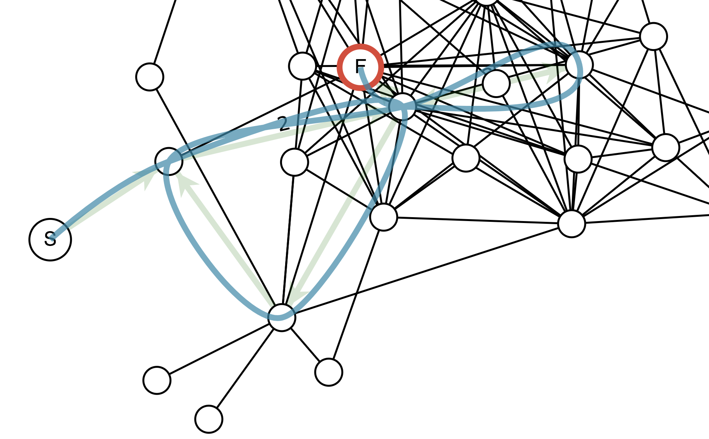
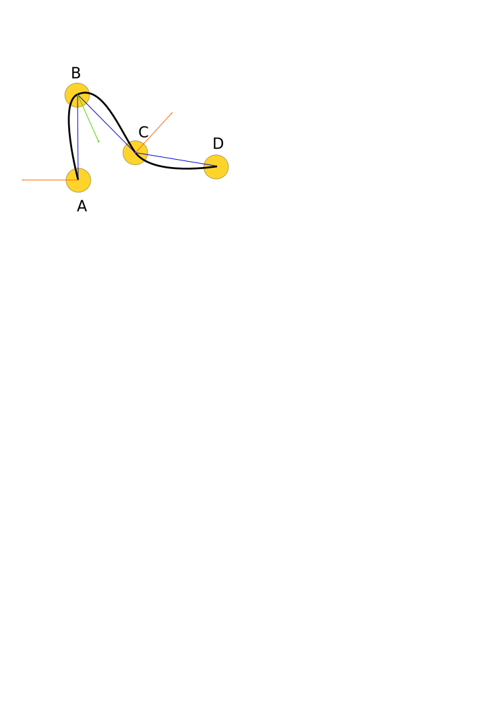

# d3-force-straighten-paths

Given a set of paths as arrays of node ids or references, and the strength associated
with each path, apply torsion spring forces to each node to attempt to straighten the
paths.

This helps with drawing paths (chains of edges) as splines.

In the diagram, arrows represent the forces on three consecutive nodes in a
chain. Nodes **A** and **C** are pushed outward perpendicular to their respective
edges to **B**. And **B** is brought between **A** and **C** with a force equal to
the negative sum of the other two forces.

The force is proportional to the square of the difference between &#x2220; and
&#960;&emdash;this penalizes tight angles more than angles closer to straight.

## API Reference

<a name="forceStraightenPaths" href="#forceStraightenPaths">#</a> <b>forceStraightenPaths</b>([<i>paths</i>])

Creates a new force with the given array of [*paths*](#forceStraightenPaths_paths). If *paths* is not specified, it defaults to the empty array.

<a name="forceStraightenPaths_paths" href="#forceStraightenPaths_paths">#</a> <i>straighten</i>.<b>paths</b>([<i>paths</i>])

If *paths* is specified, sets the force's paths to the specified array of objects. For each path object, [*straighten*.pathNodes](#forceStraightenPaths_pathNodes) will be called to get the array of nodes, and [*straighten*.pathStrength](#forceStraightenPaths_pathStrength) will be called to get the multiplier for the torsion strength of each of the internal nodes on the path.

*paths* is not modified by `forceStraightenPaths`. If the nodes arrays contain objects, they are assumed to be references to the nodes of the simulation. Otherwise [*straighten*.id](#forceStraightenPaths_id) is used to build a map of the nodes, and the nodes are used as keys into that map to get node references.

